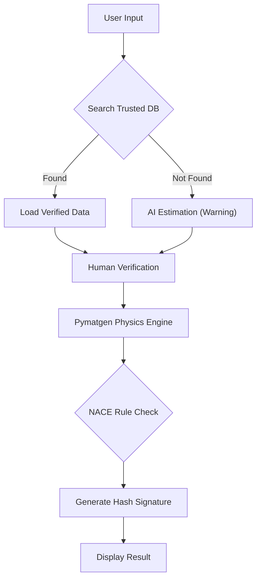

# 🛡️ ML4MS: NACE Compliance Agent
**Provenance-Enforced AI for Sour Service Material Selection**


[](https://arxiv.org/abs/2512.00977)
[](https://huggingface.co/spaces/aaburakhia/ML4MS-Material-Validator)
[](https://opensource.org/licenses/MIT)
[](https://www.python.org/downloads/)

### 🔗 [Launch Live App on Hugging Face](https://huggingface.co/spaces/aaburakhia/ML4MS-Material-Validator)

---

## 1. The Engineering Challenge
In the Oil & Gas industry, specifically in **Sour Service** ($H_2S$) environments, material selection is governed by **NACE MR0175 / ISO 15156**.
*   **The Risk:** Standard AI models (LLMs) often "hallucinate" material properties. If an AI guesses the chemistry of a Liner Hanger, it can lead to **Sulfide Stress Cracking (SSC)** and catastrophic well failure.
*   **The Goal:** Build an AI agent that **refuses to guess**. It must calculate physics deterministically and provide a digital audit trail.

## 2. Solution Architecture
This tool implements the **"Render Gate"** architecture proposed in *"Crystalyse: a multi-tool agent for materials design"* (Nduma et al., 2025).

### The Hybrid RAG Workflow
The agent uses a 3-layer verification process to ensure Asset Integrity:

1.  **Trusted Knowledge Layer:** First, it searches an internal "Approved Vendor List" (CSV Database).
2.  **Physics Engine Layer:** If the material is new, it estimates the formula but calculates **PREN** (Pitting Resistance Equivalent Number) using the `Pymatgen` Quantum Mechanics library.
3.  **The Render Gate:** Every result is cryptographically signed (SHA-256). If the UI cannot verify the hash, the data is blocked.


---

## 3. Key Features

### 🧠 Hybrid RAG Architecture
The agent does not blindly trust AI. It uses a **tiered lookup strategy**:
1.  **Tier 1 (Trusted):** Searches an internal CSV database (simulating an ERP system).
2.  **Tier 2 (Fallback):** If the material is unknown (e.g., "Unobtainium"), it uses Gemini 1.5 Pro to estimate the chemistry, but flags it as **"Low Confidence"**.

### ⚛️ Deterministic Physics Engine
Unlike standard Chatbots, this tool **does not guess numbers**.
*   It parses the chemical string (e.g., `Ni58Cr21...`) using **Pymatgen**.
*   It calculates **Molecular Weight** and **PREN** based on atomic masses.
*   **Result:** 100% mathematical accuracy, zero hallucinations.

### 🛡️ The Render Gate (Digital MTR)
Every calculation generates a **SHA-256 Cryptographic Hash**.
*   The UI will **refuse to display** any engineering verdict unless the data payload matches its signature.
*   This creates a digital audit trail equivalent to a physical **Material Test Report (MTR)**.

### 👷 Human-in-the-Loop Verification
Asset Integrity requires human oversight. The app allows the engineer to **Edit the Chemical Formula** before the calculation runs, ensuring the simulation matches the specific heat number of the steel being purchased.

---

## 4. Installation & Usage

You can run this agent locally on your own machine.

### Prerequisites
*   Python 3.10+
*   A Google Gemini API Key (Free)

### Setup Guide

```bash
# 1. Clone the repository
git clone https://github.com/aaburakhia/ML4MS-Material-Validator.git
cd ML4MS-Material-Validator

# 2. Install dependencies
pip install -r requirements.txt

# 3. Set your API Key (Linux/Mac)
export GOOGLE_API_KEY="your_actual_api_key_here"

# 3. Set your API Key (Windows PowerShell)
$env:GOOGLE_API_KEY="your_actual_api_key_here"

# 4. Launch the App
streamlit run app.py
```

---

## 5. Scientific References

This project is an implementation of the **"Render Gate"** architecture described in:

> **Crystalyse: a multi-tool agent for materials design**  
> *Ryan Nduma, Hyunsoo Park, and Aron Walsh*  
> Department of Materials, Imperial College London (2025)  
> 📄 [Read the Paper on arXiv](https://arxiv.org/abs/2512.00977)

**Engineering Standards:**
*   **NACE MR0175 / ISO 15156:** *Petroleum and natural gas industries — Materials for use in H2S-containing environments.*
