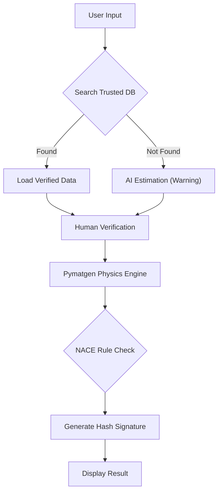

# 🛡️ ML4MS: NACE Compliance Agent

**Provenance-Enforced AI for Sour Service Material Selection**

### 🔗 [Launch Live App on Hugging Face](https://huggingface.co/spaces/aaburakhia/ML4MS-Material-Validator)

---

## 1. The Engineering Challenge
In the Oil & Gas industry, specifically in **Sour Service** ($H_2S$) environments, material selection is governed by **NACE MR0175 / ISO 15156**.
*   **The Risk:** Standard AI models (LLMs) often "hallucinate" material properties. If an AI guesses the chemistry of a Liner Hanger, it can lead to **Sulfide Stress Cracking (SSC)** and catastrophic well failure.
*   **The Goal:** Build an AI agent that **refuses to guess**. It must calculate physics deterministically and provide a digital audit trail.

## 2. Solution Architecture
This tool implements the **"Render Gate"** architecture proposed in *"Crystalyse: a multi-tool agent for materials design"* (Nduma et al., 2025).

### The Hybrid RAG Workflow
The agent uses a 3-layer verification process to ensure Asset Integrity:

1.  **Trusted Knowledge Layer:** First, it searches an internal "Approved Vendor List" (CSV Database).
2.  **Physics Engine Layer:** If the material is new, it estimates the formula but calculates **PREN** (Pitting Resistance Equivalent Number) using the `Pymatgen` Quantum Mechanics library.
3.  **The Render Gate:** Every result is cryptographically signed (SHA-256). If the UI cannot verify the hash, the data is blocked.

---
## 📚 Scientific References

This project is an implementation of the **"Render Gate"** architecture described in:

> **Crystalyse: a multi-tool agent for materials design**  
> *Ryan Nduma, Hyunsoo Park, and Aron Walsh*  
> Department of Materials, Imperial College London (2025)  
> 📄 [Read the Paper on arXiv](https://arxiv.org/abs/2512.00977)

**Engineering Standards:**
*   **NACE MR0175 / ISO 15156:** *Petroleum and natural gas industries — Materials for use in H2S-containing environments.*
